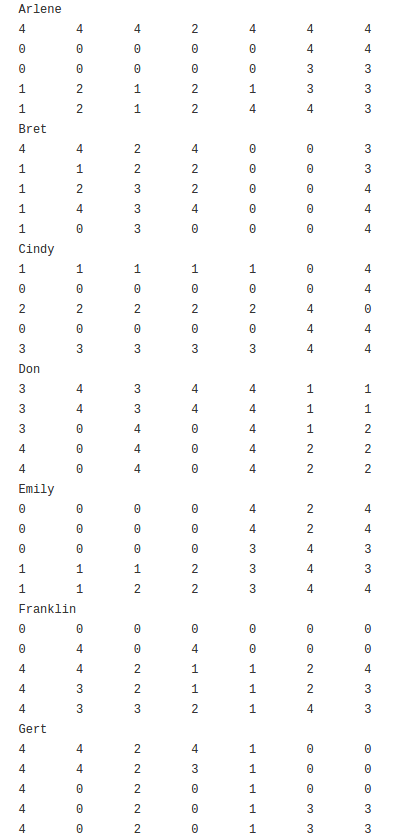
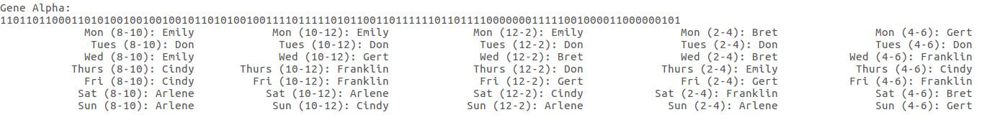

# Scheduling-GA
Genetic Algorithm solving a scheduling problem with three different genome encodings

Encoding types:
- Binary
- Gray
- Integer/Object

## Sample Results

Sample input from testcase #2

Sample results from gray encoding, testcase #2
